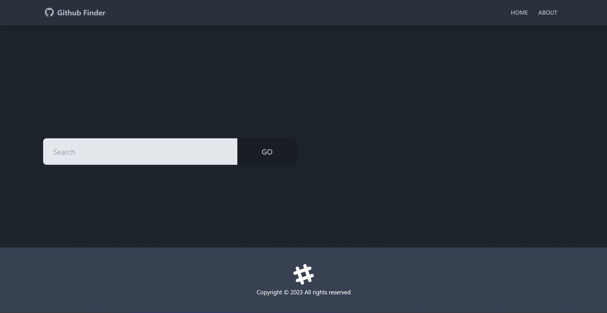

# Github User search

A React app to search GitHub profiles and see profile details. This project is part of the React Front To Back Udemy course by Brad Traversy.

Implemented by Luke Shea using React, Tailwind, DaisyUI, Vite, and lots of coffee.

## Table of contents

-   [Overview](#overview)
    -   [The challenge](#the-challenge)
    -   [Screenshot](#screenshot)
    -   [Links](#links)
-   [My process](#my-process)
    -   [Built with](#built-with)
    -   [What I learned](#what-i-learned)
-   [Author](#author)

## Overview

### The challenge

Users should be able to:

-   Search for Github users using the search bar.
-   Click on a users name to get more details about their Github page
-   Click a link in their details to visit their actual Github page
-   Browse through a list of all a users most recent repos

### Screenshot

### Links

-   Solution URL: [https://transcendent-jalebi-209f54.netlify.app/](https://transcendent-jalebi-209f54.netlify.app/)

## My process

### Built with

-   Vite
-   fetch API
-   Github API
-   [React](https://reactjs.org/) - JS library
-   Tailwind CSS
-   DaisyUI (React Component Library)

### What I learned

Completing this project taught about the nuances of contacting a 3rd party API (including headers, user tokens, etc.) and the magic of React component libraries. DaisyUI made some of the design aspects much more simple and was quite easy to use, I'm looking forward to using it more in the future.
I also learned quite a bit about conditional rendering and how to make webpages respond in the way I want using some simple logic and ternary operators.

## Author

-   Website - [https://www.lukeinthecloud.com](https://www.lukedinthecloud.com)
